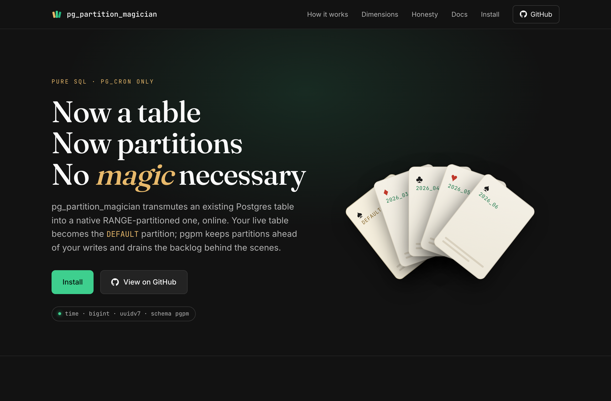

# pg_partition_magician

**[→ Explainer &amp; install page](https://dventimisupabase.github.io/improved-octo-happiness/)**

[](https://dventimisupabase.github.io/improved-octo-happiness/)

A lightweight, **pure-SQL** RANGE-partition manager for PostgreSQL whose only
runtime dependency is **pg_cron**, and even that only to run its background jobs. No compiled
extension, no superuser beyond what running a SQL script needs. Install it by
running one file.

It partitions on three kinds of **monotonic** key: time, integer/bigint ids (including
Snowflake-style ids), or **UUIDv7 / ULID** (time-ordered uuids). It then manages the
full lifecycle of native `RANGE`-partitioned tables:

- **`adopt()` / `adopt_by_id()` / `adopt_by_uuidv7()`**: convert an existing
  (possibly huge, *live*) unpartitioned table into a partitioned one **online**,
  with no up-front data movement.
- **premake**: keep N partitions ahead of the write frontier so live writes
  always have a real partition.
- **drain**: move the `DEFAULT` partition's closed tail into proper partitions in
  paced microbatches.
- **retention**: drop partitions older than a policy.
- **maintenance**: the single procedure `pg_cron` calls (premake + retention + drain).

Think "a slice of `pg_partman`, installable as plain SQL." The schema is `pgpm`.

## Why it exists

`pg_partman` is excellent, but it's a compiled C extension: it needs `CREATE
EXTENSION`, the binary installed, and privileges that some managed/locked-down
Postgres environments don't grant. `pg_partition_magician` is just tables, views,
and PL/pgSQL; you can install it anywhere you can run SQL and schedule a job.

## Install

Prefer copy-paste? The [install page](https://dventimisupabase.github.io/improved-octo-happiness/install.html)
has one-click bundles and the registry command.

`sql/pg_partition_magician.sql` is the single source of truth: pure SQL, idempotent,
no psql metacommands. It ships through three channels (all built from that one file):

```bash
# psql -- run the source directly (the simplest path on any Postgres)
psql "$DATABASE_URL" -f sql/pg_partition_magician.sql
```

For a SQL client that doesn't process psql metacommands (a dashboard editor, say),
build a self-contained `BEGIN/COMMIT`-wrapped bundle and paste it in:

```bash
scripts/build_install_bundle.sh sql/pg_partition_magician.sql dist/pg_partition_magician-bundle.sql
```

`extension.control` carries the TLE metadata (`requires = 'pg_cron'`). Uninstall with
`psql -f sql/uninstall.sql` (removes the `pgpm` schema + its cron jobs; your partitioned
tables and data are left intact).

For completeness, on a managed Postgres that has `pg_tle` it can also be installed as a
Trusted Language Extension from [database.dev](https://database.dev), but the `psql -f`
path above is simpler and is the recommended way:

```sql
select dbdev.install('dventimisupabase@pg_partition_magician');
create extension "dventimisupabase@pg_partition_magician" version '0.1.0' cascade;
```

## Use it

```sql
-- Convert an existing table online and register it (zero data movement here):
select pgpm.adopt(
  p_parent      => 'public.events',
  p_control     => 'created_at',     -- the timestamp to range-partition on
  p_interval    => '1 day',          -- daily/weekly/monthly/yearly...
  p_premake     => 7,                -- keep 7 partitions ahead
  p_retention   => '90 days',        -- drop partitions older than this (null = keep)
  p_paused      => false             -- let scheduled maintenance run
);

-- Schedule the one entry point (pg_cron):
select cron.schedule('pgpm', '1 minute', 'call pgpm.maintenance_all()');
```

That's it. Maintenance premakes ahead, drains the adopted table's closed tail into
partitions, and applies retention. Watch it with `select * from pgpm.status();`.

### Partitioning dimensions

A control column qualifies if it is (a) RANGE-partitionable, (b) monotonic with
insertion within a bounded lag, (c) has exact, reproducible grid arithmetic, and
(d) free of unordered/extreme values that poison the frontier. The engine maps
every supported type onto one of two grids via a tiny adapter; the only thing that
changes per kind is `_grid_floor` / `_grid_next` / `_encode` / `_decode` /
`_frontier_native` / `_part_name`.

| `control_kind` | Adopt with | Column types | Step / retention | Notes |
|---|---|---|---|---|
| `time` | `adopt(…, p_interval)` | `timestamptz` / `timestamp` / `date` | interval / interval | calendar-aligned |
| `id` | `adopt_by_id(…, p_step)` | `int` / `bigint` / **`numeric`** | bigint / bigint count | covers Snowflake-style ids; frontier = `max(id)` |
| `uuidv7` | `adopt_by_uuidv7(…, p_interval)` | `uuid` | interval / interval | time grid, boundaries encoded as uuids; also **ULID-as-uuid** |

The "frontier" generalizes `now()`: for `id`/`uuidv7` it's the current max of the
control column. **float/double are explicitly rejected**: they can't guarantee
gapless boundaries and `NaN`/`Inf` sort highest and poison the frontier. When the
partition key *is* the column other tables reference (typical for `id`), the PK
stays single-column and **incoming FKs need no denormalization**: just a re-point.

UUIDv7/ULID generation is the app's job (PG 15 has no `uuidv7()`); the tool only
stores, compares, and encodes boundary uuids: a pure-SQL `uuid↔ms` codec. Since
the column type is just `uuid`, `adopt_by_uuidv7()` can't *know* the values are
time-ordered, so it samples them and **warns** if they don't decode to plausible
recent timestamps (i.e. likely random/UUIDv4); `pgpm.check_uuidv7(table, col)` runs
the same check on demand. It's a heuristic, not a proof.

### API

| Function | Purpose |
|---|---|
| `pgpm.adopt(parent, control, interval, …)` | Online swap + register + premake, **time** kind |
| `pgpm.adopt_by_id(parent, control, step, …)` | Online swap, **id** kind (bigint/numeric) |
| `pgpm.adopt_by_uuidv7(parent, control, interval, …)` | Online swap, **uuidv7/ULID** kind |
| `pgpm.maintenance_all()` | Premake + retention + one drain batch for every managed table (the pg_cron entry) |
| `pgpm.maintenance(parent)` | Same, for one table (respects the pause flag) |
| `pgpm.premake(parent)` | Create partitions up to `premake` ahead of now |
| `pgpm.drain_step(parent, batch, include_open)` | Move one microbatch out of the DEFAULT; attach when an interval empties |
| `pgpm.drain_all(parent, batch, include_open)` | Drive the drain to completion (ignores pause) |
| `pgpm.retention(parent)` | Drop partitions older than the policy |
| `pgpm.check_default(parent)` | Rows still in the DEFAULT, and how many are in already-closed intervals (the alert) |
| `pgpm.check_uuidv7(table, col)` | Sanity-sample a uuid column: fraction whose embedded prefix decodes to a plausible recent timestamp (catches random/v4) |
| `pgpm.generate_fk_recovery(parent)` | Emit a path-A recovery script per dropped incoming FK (denormalize + composite FK) |
| `pgpm.status()` / `pgpm.partitions` | Monitoring |

Config lives in `pgpm.config` (one row per managed table); a partition registry in
`pgpm.part`; an action audit trail in `pgpm.log`.

## How the online migration stays online

Two hard facts drive the design:

1. **You can't convert a table to partitioned in place.** So `adopt()` renames the
   live table out of the way, creates a partitioned parent under the original name,
   and **attaches the old table as the `DEFAULT` partition**: no rows move, the app
   sees no change. The PK has to widen to include the partition key (e.g.
   `(created_at, id)`), and *how that index gets built* is what decides whether the
   cutover is actually online, there are two paths:
   - **Recommended, pre-build it online.** Run `build_pk_concurrently()` first; it
     issues a `CREATE UNIQUE INDEX CONCURRENTLY` on the live table through a `pg_cron`
     worker (no blocking). `adopt()` then *promotes that ready index* to the default's
     PK and the parent's PK reuses it, **metadata only**, so adopt holds its
     `ACCESS EXCLUSIVE` lock only briefly.
   - **Fallback, build it during the cutover.** If no matching index exists, `adopt()`
     builds it in-transaction while holding `ACCESS EXCLUSIVE`: correct, but `O(rows)`
, a multi-minute write-blocking window on a large table (~28 min at 300M rows).
     Fine for small tables, not "online."

   (Either way, creating the parent *with* a PK and then attaching would instead rebuild
   that index across the whole default under `ACCESS EXCLUSIVE`, so pgpm establishes the
   default's PK first and has the parent reuse it.) Identity moves to the parent; non-unique
   secondary indexes are carried over by attaching the default's existing index.
2. **Adding a partition while the `DEFAULT` holds data forces a full scan of the
   `DEFAULT` under `ACCESS EXCLUSIVE`** (PG 15 docs), the biggest scaling risk.

The tool sidesteps #2 for every range that receives **no concurrent writes**,
closed past intervals (drain) and future intervals (premake), by:

```sql
ADD CONSTRAINT excl CHECK (control < lo OR control >= hi) NOT VALID  -- catalog only, instant
VALIDATE CONSTRAINT excl                                            -- the scan, under SHARE UPDATE EXCLUSIVE (non-blocking)
ATTACH / CREATE PARTITION ...                                       -- default scan skipped, metadata-only
DROP CONSTRAINT excl
```

The one rule that keeps this safe: **never exclude the interval currently receiving
writes.** A `NOT VALID` CHECK is enforced on new rows, so excluding the live range
would *reject* writes routing to the default. So the active interval simply lives in
the `DEFAULT` until it closes, then drains as a closed tail, and premake keeps
future intervals ready so live writes always have a real partition. *The only window
we ever drain is the now-closed tail.*

Measured on PG 15 (4M-row default): plain attach **101 ms** under `ACCESS EXCLUSIVE`
vs scan-skip attach **0.43 ms**; the ~97 ms scan moves to `VALIDATE` under the
non-blocking lock. Same for `CREATE … PARTITION OF` premake (108 ms → 2 ms).

For the open/current interval there's no non-blocking option (a `NOT VALID` CHECK
would reject live writes), so it attaches via a **plain** `ATTACH`, which *blocks*
briefly rather than *rejecting*. Cheapest when it's drained last, against a small
default. Force it with `drain_all(parent, include_open => true)`.

## Try it

Install the module, then adopt a table and watch it work:

```sql
-- after psql -f sql/pg_partition_magician.sql (and pg_cron enabled)
select pgpm.adopt('public.your_events', 'created_at', '1 month');
select * from pgpm.status();                          -- partitions, rows still in DEFAULT
update pgpm.config set paused = false;                -- let scheduled maintenance run
-- or drive it synchronously, finishing the current period too:
select pgpm.drain_all('public.your_events', p_include_open => true);
```

`fixtures/demo.sql` builds three throwaway tables and adopts one of each kind
(`messages` by time, `events_id` by bigint, `events_uuid` by uuidv7); the test
harness loads it, and you can `psql -f` it yourself against a scratch database.

## Tests

53 pgTAP tests across structure, write-routing, drain, row conservation, the
scan-skip attach method, premake, retention, secondary-index propagation,
incoming-FK handling + recovery, and the `id` and `uuidv7` dimensions (incl. the
uuid↔ts codec). Testing needs only **Docker**, no other tooling.

```bash
./test.sh                       # all versions x all channels
./test.sh 15                    # one PostgreSQL version, all channels
./test.sh 15 --channel=bundle   # one version / channel
```

For each PostgreSQL version (15, 16, 17, 18) `test.sh` builds a `pg_cron`+`pgtap`
image (`Dockerfile`/`docker-compose.yml`), installs the module through each channel,
loads `fixtures/demo.sql`, runs `pg_prove tests/*.sql`, and verifies a clean
uninstall. It's exactly what `.github/workflows/test.yml` runs on every push.

## v1 scope & caveats

- **Dimensions**: `time` (interval step; whole-month or fixed-duration; mixed
  month+duration is rejected), `id` (bigint/numeric step), `uuidv7`/ULID-as-uuid
  (time grid, uuid boundaries). **float/double rejected.** Other sortable encodings
  (KSUID, base32 ULID, ObjectId) aren't built in: partition on a companion column.
- **Monotonicity is the precondition.** uuidv7/ULID are ms-resolution monotonic with
  a small clock-skew/late-arrival window; the don't-close-until-frontier-past rule
  plus the `DEFAULT` safety net absorb stragglers. Arbitrary backdated keys break it.
- **Empty `DEFAULT` kept as a safety net** (`keep_default`). In steady state premake
  stays ahead so the default stays empty; `check_default()` flags any stray row.
- **Retention uses plain `DROP`** (brief lock). `DETACH … CONCURRENTLY` can't run
  inside a function; for huge cold partitions, detach concurrently by hand.
- **Secondary indexes**: `adopt()` copies the old table's non-unique secondary
  indexes onto the parent as partitioned indexes (attaching the default's existing
  index, no rebuild), so they propagate to every partition. Unique secondary indexes
  are skipped (a partitioned unique index must include the partition key); recreate
  those on the parent by hand.
- **Incoming foreign keys**: see the dedicated section below; `adopt()` refuses by
  default and offers an opt-in drop.
- Tested on PostgreSQL **15, 16, 17, and 18**. Boundaries align to the database
  timezone (UTC by default).

## Incoming foreign keys

If other tables reference the table you're adopting (e.g. `reactions(message_id) →
messages(id)`), partitioning forces a hard reckoning, because a partitioned table's
**only** unique key is one that includes the partition key:

- A single-column FK like `→ messages(id)` becomes **impossible** (*"there is no
  unique constraint matching given keys"*), and the old PK can't even be dropped
  while a dependent FK exists.
- The only way to keep DB-enforced RI is a **composite FK**: the referencing table
  must also carry `created_at` and reference `messages(created_at, id)`. (A composite
  FK to the *parent* survives the drain: a row keeps its `(created_at, id)` as it
  moves between partitions.)

So there's no "move the FK" trick; FKs can only be dropped and recreated, and
recreating requires denormalizing the partition key into the referencing side. This
is the operator's data-model decision, so `adopt()` doesn't do it silently:

- **Default (`p_incoming_fks => 'error'`)**: detects incoming FKs and **refuses**
  with a report, mutating nothing.
- **`p_incoming_fks => 'drop'`**: drops each incoming FK and records its original
  definition in `pgpm.dropped_fk`, then proceeds. You then either re-enforce RI in
  the app, or rebuild composite FKs after denormalizing the referencing tables.

```sql
select pgpm.adopt('public.messages', 'created_at', '1 month', p_incoming_fks => 'drop');
select * from pgpm.dropped_fk;   -- what was dropped, for reconstruction
```

To take path A, `generate_fk_recovery()` emits a ready-to-review script per dropped
FK: add the partition-key companion column, backfill it, and rebuild the FK as a
composite FK (with `NOT VALID` + `VALIDATE` to avoid a long lock). It's generated,
not executed:

```sql
select sql from pgpm.generate_fk_recovery('public.messages');
```

```sql
-- e.g. for reactions(message_id) -> messages(id):
ALTER TABLE public.reactions ADD COLUMN message_created_at timestamp with time zone;
UPDATE public.reactions r SET message_created_at = p.created_at
  FROM public.messages p WHERE p.id = r.message_id;
ALTER TABLE public.reactions ALTER COLUMN message_created_at SET NOT NULL;
ALTER TABLE public.reactions ADD CONSTRAINT reactions_message_id_fkey
  FOREIGN KEY (message_created_at, message_id) REFERENCES public.messages (created_at, id) NOT VALID;
ALTER TABLE public.reactions VALIDATE CONSTRAINT reactions_message_id_fkey;
```

Review it (the companion column name is a suggestion; batch the backfill for large
tables) and update the app to populate the new column going forward.

(`pg_partman` reaches the same conclusion: its howto says incoming FKs require an
outage to drop and recreate against the new partitioned table.)

## Releasing & publishing

Tag a version and CI does the rest (`.github/workflows/release.yml`):

```bash
git tag v0.1.0 && git push origin v0.1.0
```

On a `v*` tag the Release workflow runs the full PG 15–18 channel matrix, creates a
GitHub Release with the bundle + minified dbdev package + a source tarball (release
notes pulled from `CHANGELOG.md`), then calls `publish-dbdev.yml` to push the package
to [database.dev](https://database.dev). You can also run either workflow manually via
*workflow_dispatch* with an explicit version.

> **One manual step CI can't do:** on a version bump, bump the pinned `version '…'`
> in the [Install](#install) section's dbdev example. The install page fills it in from the
> release tag automatically; this README copy is pinned by hand (dbdev recommends pinning).

**One-time setup for publishing** (the publish job is inert until both exist):

1. Create a [database.dev](https://database.dev) account and an API token.
2. Add it as a repo secret named **`DBDEV_TOKEN`** (Settings → Secrets and variables →
   Actions). The package publishes under your account handle as
   `@dventimisupabase/pg_partition_magician`.

> The dbdev channel is build- and psql-install-tested in CI, but the TLE
> `CREATE EXTENSION` path itself is exercised at publish/install time (no dbdev
> account in CI).
