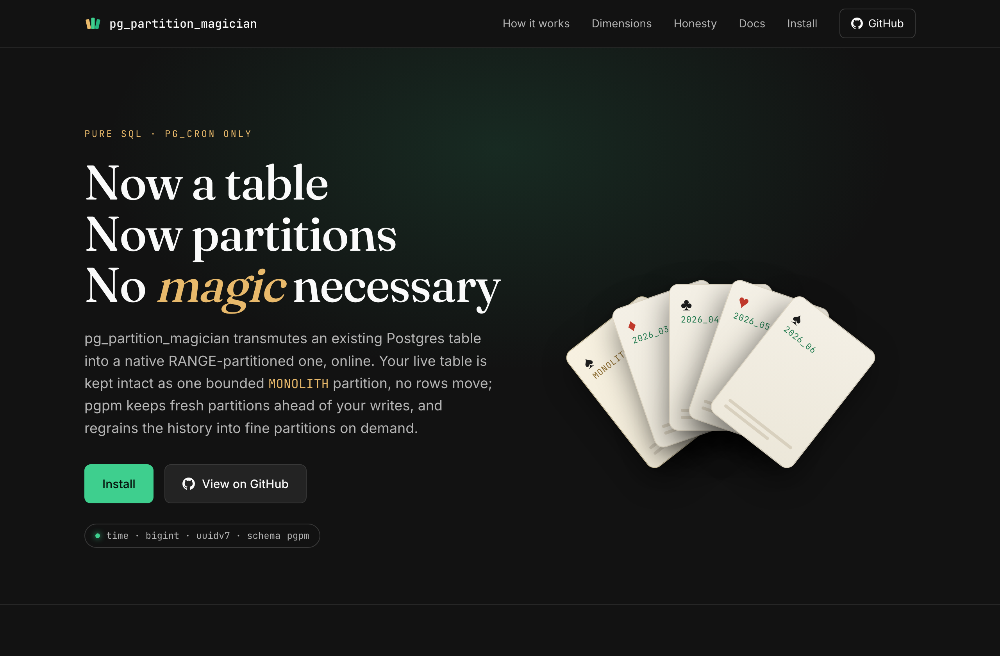

# pg_partition_magician

**[→ Explainer &amp; install page](https://dventimisupabase.github.io/pg_partition_magician/)**

[](https://dventimisupabase.github.io/pg_partition_magician/)

Online RANGE partitioning for PostgreSQL, in **pure SQL**. No compiled extension, no superuser: install it
by running one file. The only runtime dependency is **pg_cron**, and only to run the background job.

It partitions on any **monotonic** key (time, integer/bigint ids including Snowflake, or **UUIDv7 / ULID**)
and manages the whole lifecycle:

- **`transmute`**: convert a live, unpartitioned table to partitioned **with no row movement**. The
  original is renamed aside and attached intact as one bounded **monolith** child; a fresh `DEFAULT` is the
  safety net. The cutover is one read-only scan plus a metadata flip: no rebuild, no row rewrite. The table
  is **locked for the duration of that scan**, so size a maintenance window from its row count (see
  [the guide](docs/guide.md#the-cutover-moves-no-rows)). Reversible with **`untransmute`** until the
  history outgrows the monolith.
- **`obtain`**: keep N partitions ahead of the write frontier.
- **`regrain`**: split the monolith into fine partitions on demand, by **copying** (no dead tuples, no
  vacuum). Optional, a coarse monolith is a correct permanent state.
- **`retain`**: drop partitions past a policy. Set `config.archive_fn` to a resumable archive
  strategy -- e.g. archive to long-term storage, see the optional [`pgpm_archive`](#archiving-optional)
  add-on for ready-made ones -- and a partition only drops once it's fully archived, never before.
- **`maintain`**: the one procedure `pg_cron` calls (`obtain`, `retain`, optional auto-`regrain`).

The schema is `pgpm`. Think "a slice of `pg_partman`, installable as plain SQL."

Two caveats, both covered in the [guide](docs/guide.md). There is **no `DEFAULT` partition**: `obtain`
keeps a grid of real partitions ahead of the write frontier, and a write beyond that grid is *refused*
rather than parked somewhere. `config.obtain x partition_step` is therefore both your slack if maintenance
stalls and a ceiling on how far ahead you may write. And **incoming foreign keys** are preserved, not
ignored (`transmute` never rewrites your key; `p_incoming_fks => 'preserve'` re-adds each one once the
table is quiescent).

## Why it exists

`pg_partman` is excellent, but it is a compiled C extension: it needs `CREATE EXTENSION`, the binary, and
privileges some managed or locked-down environments do not grant. `pg_partition_magician` is just tables,
views, and PL/pgSQL, so it installs anywhere you can run SQL and schedule a job.

## Modules

`pgpm_core` is the only required piece. Everything else is an independent, optional add-on that
loads on top of it (never before it); none of the add-ons depend on each other, and installing any
subset in any order is fine.

| Directory | What it's for | When you need it |
|---|---|---|
| **`pgpm_core`** | The product itself: `transmute`/`obtain`/`retain`/`regrain`/`maintain`. | Always. |
| **`pgpm_hypertable`** | A one-time [migration tool](#migrating-from-timescaledb) (`from_hypertable`) that converts a TimescaleDB hypertable to a pgpm-managed table, then hands off to `transmute`. Not something you keep using afterward. | Only if migrating off TimescaleDB (Apache edition). |
| **`pgpm_archive`** | Ready-made S3 [archive strategies](#archiving-optional) for `config.archive_fn` (see `retain` above). | Only if you want `retain` to archive a partition's data before dropping it; without it, `archive_fn` stays `null` and partitions just drop. |

## Install

```bash
psql "$DATABASE_URL" -f pgpm_core/install.sql
```

The [install page](https://dventimisupabase.github.io/pg_partition_magician/install.html) has dashboard
copy-paste bundles and the registry command; the [guide](docs/guide.md#install) covers all three channels
and uninstall. `pg_cron` must be enabled for scheduled maintenance.

## Quickstart

```sql
-- 1. Convert and register. Registers PAUSED: nothing moves until you resume.
call pgpm.transmute(
  p_parent   => 'public.events',
  p_control  => 'created_at',         -- the key to range-partition on (must be in the PK)
  p_interval => interval '1 month',
  p_obtain   => 7,                    -- keep 7 partitions ahead
  p_retain   => '90 days'             -- drop partitions older than this (null = keep)
);

-- 2. Schedule maintenance (one job covers every managed table):
select pgpm.schedule();

-- 3. Inspect, then go live:
select * from pgpm.status();
select pgpm.resume('public.events');

-- 4. (optional) Split the coarse history into fine partitions, paced across ticks:
select pgpm.set_regrain('public.events', '1 month');
```

The two-step (transmute paused, then `resume`) lets you inspect before anything moves. `transmute` reuses a
primary key or unique constraint that includes the control column, or partitions keyless if neither exists;
the one hard requirement is a `NOT NULL` control column. See the
[walkthrough](docs/guide.md#transmute-a-table).

## Migrating from TimescaleDB

On a **TimescaleDB hypertable** (Apache edition)? `from_hypertable` migrates it to a pgpm-managed partition
set: an online copy into one plain table, done chunk by chunk (the source keeps serving traffic), then a
brief cutover that hands off to `transmute`. It preserves keys, indexes, identity, generated columns,
`CHECK`/defaults/`NOT NULL`, and translates a `drop_chunks` policy into pgpm `retain`. Keyed and keyless
hypertables both migrate.

```sql
call pgpm.from_hypertable('public.metrics', 'ts', interval '1 day');
```

For workloads that update or delete during the copy, pass `p_track_changes => true` (it reconciles by key, so
it needs one; keyless tables migrate append-only). Either way the catch-up backlog is drained **online before
the cutover**, so the lock applies only a tiny residual.

One keyless caveat: a translated `drop_chunks` retention stays dormant until you add a key and `regrain` the
history (`retain` drops fine partitions, not the monolith).

It is an optional add-on, loaded only where the `timescaledb` extension exists:

```bash
psql "$DATABASE_URL" -f pgpm_hypertable/install.sql
```

See the [reference](docs/reference.md#migrating-from-timescaledb-from_hypertable) for the phases and knobs.

## Observability

pgpm logs every operation to `pgpm.log` but keeps no system-wide history. With
[`pg_flight_recorder`](https://github.com/dventimisupabase/pg_flight_recorder) (PGFR) installed,
`pgpm.impact_report` reports what the workload experienced during a conversion (checkpoints, WAL, waits,
latency) and `pgpm.feathering_validation` validates each adaptive-feathering backoff against PGFR's
independent sampling.

```sql
select pgpm.impact_report('public.events');
select * from pgpm.feathering_validation('public.events');
```

Both ship with `pgpm_core`, read-only, and PGFR is **never a dependency**: they raise a clear error until
it's installed.

## Archiving (optional)

`retain` drops partitions past a policy, but data doesn't have to just disappear: the optional
`pgpm_archive` add-on supplies ready-made archive strategies (NDJSON and Parquet, to S3 or any
S3-compatible store, optionally GZIP-compressed) for `config.archive_fn`. Set it once (after the
one-time connection setup covered in [`pgpm_archive/README.md`](pgpm_archive/README.md)), and a
partition only drops once it's been fully archived -- automatically, in bounded chunks, ahead of
every drop:

```sql
select pgpm.set_archive_fn('public.events', 'pgpm.archive_to_s3_parquet(regclass,name,text,text)'::regprocedure);
```

Load it on top of the core:

```bash
psql "$DATABASE_URL" -f pgpm_archive/install.sql
```

See [`pgpm_archive/README.md`](pgpm_archive/README.md) for the full picture: connection setup,
choosing NDJSON vs. Parquet, and the synchronous alternative (`archive.to_s3`/`archive.to_s3_parquet`)
for manual, one-off archiving instead of the automatic `archive_fn` path.

## Documentation

- **[User guide](docs/guide.md)**: concepts, install, transmute, scheduling, regrain, retain, foreign keys,
  troubleshooting.
- **[Reference](docs/reference.md)**: every function and catalog object.
- **[Runbook](docs/runbook.md)**: symptom-driven operational procedures.
- **[Explainer](https://dventimisupabase.github.io/pg_partition_magician/)**: the visual overview.

## Tests

```bash
./test.sh        # full matrix: PG 15-18 x all install channels
./test.sh 15     # one version, all channels
```

pgTAP on Docker, exactly what CI runs on every push. See [ONBOARDING.md](ONBOARDING.md) for the dev loop.

## License

[Apache License 2.0](LICENSE). See [NOTICE](NOTICE) for attribution.
