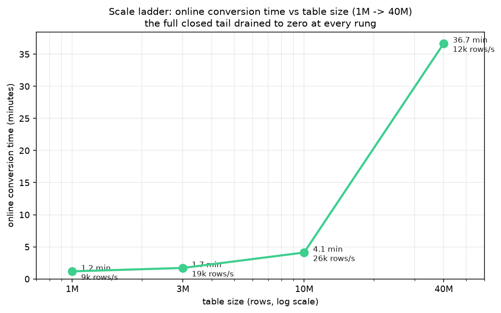
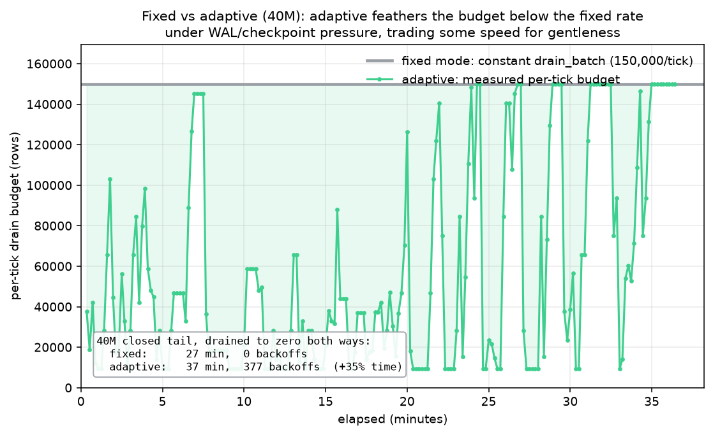

# Partition a live Postgres table online, with nothing but SQL

*Draft. Figures are in `bench/figures/` as PNG (shown here) and vector SVG (use the SVGs for the published post).*

Partitioning a table you wish you had partitioned a year ago is one of Postgres's sharpest edges. The table is already large and already serving traffic, and the textbook fix (create a partitioned copy, backfill it, swap it in) wants a maintenance window, double the storage, and a careful application dance. So the table just keeps growing: autovacuum strains, indexes bloat, and "retention" becomes a `DELETE` that fights your workload.

**pg_partition_magician** does the conversion online, in the background, with nothing but SQL.

## What it is

pg_partition_magician (pgpm) is a pure-SQL manager for native PostgreSQL `RANGE` partitioning. It converts an existing, possibly huge, *live* table into a partitioned one with no up-front data movement, then runs the whole partition lifecycle for you: it keeps real partitions ahead of your writes, moves the old data into place in paced background batches, and drops partitions past their retention policy.

Its only runtime dependency is `pg_cron`, and even that is just to run the background job. You install it by running one SQL file. Think "a slice of `pg_partman`, installable as plain SQL." The schema is `pgpm`.

## Why it exists

`pg_partman` solves the partition lifecycle beautifully, but it is a compiled C extension: it needs `CREATE EXTENSION`, the binary installed on the server, and privileges that many managed or locked-down Postgres environments do not grant. If you cannot install it, the lifecycle problem is still yours.

pg_partition_magician is just tables, views, and PL/pgSQL. If you can run a SQL script and schedule a job, you can run it, managed Postgres included.

## How it works

### The cutover is metadata-only

pgpm partitions on a *monotonic* key: a timestamp, an integer/bigint id (including Snowflake-style ids), or a UUIDv7/ULID. It asks one thing of you: that key must already be part of the table's primary key. Given that, `transmute()` converts the table with no data movement. Your existing table becomes the `DEFAULT` partition of a new partitioned parent, and because that key is already in the primary key, the PK is reused in place, so nothing is rewritten. The cutover is a metadata operation that returns in milliseconds, even on a table with tens of millions of rows.

### Then pg_cron drives the lifecycle

You schedule one procedure, `pgpm.maintenance_all()`, on `pg_cron`. Each tick it does three things:

- **attain**: keep N real partitions ahead of the write frontier, so live inserts always land in a real partition and never pile up in the `DEFAULT`.
- **drain**: move the `DEFAULT`'s closed tail (the rows that now belong in a real partition) into that partition, in small paced batches.
- **retain**: drop partitions older than your policy.


The cutover moved no data; this is the data moving afterward, in the background, while the table stays online.

### The drain is a background janitor, and behaves like one

Copying data on a busy database is exactly the thing that wrecks tail latency, so pgpm's entire posture is to stay invisible. The drain works in small paced batches under `SHARE UPDATE EXCLUSIVE` (which blocks neither reads nor writes), takes the brief stronger lock only for the instant it attaches a finished partition, and runs every step under a short `lock_timeout` inside its own subtransaction. If it ever loses a lock race to your workload, it defers and retries instead of blocking anyone.


That is the headline: the workload's p50 and p95 latency sit on the baseline for the entire conversion. The partitioning is happening underneath, unnoticed.

### It self-tunes to stay out of the way

A drain that is too eager floods the write-ahead log and triggers checkpoint storms, which hurts everyone. With adaptive feathering on (`pgpm.set_drain_adaptive`), the per-tick drain budget rides an AIMD controller, the same additive-increase / multiplicative-decrease law TCP uses to sit just under a link's capacity: it probes upward when the database is calm and halves the moment it senses WAL or checkpoint pressure.


It also watches the workload directly. A second, self-calibrating signal learns this database's *normal* level of IO and lock contention, then backs the drain off when a workload spike pushes live contention above that learned baseline, and resumes once the spike passes. The drain yields to your traffic, not the other way around.


### It scales, and the pace is a dial

The cutover is always instant. The only thing that grows with table size is the background drain, and that is the part you control.



Faster is not always better. At 40M rows, draining flat-out (a fixed rate) finishes sooner but drives the disk harder; adaptive feathering takes a little longer in exchange for staying under WAL and checkpoint pressure the whole way. You set the pace to your slack rate and let it feather down automatically under load.



## Try it

```sql
-- 1. Convert a live table online and register it (no data moves here):
select pgpm.transmute(
  p_parent   => 'public.events',
  p_control  => 'created_at',        -- the monotonic key to range-partition on
  p_interval => interval '1 month',  -- daily / weekly / monthly / yearly ...
  p_attain   => 7,                   -- keep 7 partitions ahead of writes
  p_retain   => '90 days',           -- drop partitions older than this (null = keep)
  p_paused   => false                -- let scheduled maintenance run
);

-- 2. Schedule the one entry point (pg_cron):
select cron.schedule('pgpm', '1 minute', 'call pgpm.maintenance_all()');

-- 3. Watch it:
select * from pgpm.status();
```

That is the whole thing. The cutover is metadata-only, the backlog drains itself in the background without anyone noticing, and retain keeps the table trim, all from a single SQL file on any Postgres that has `pg_cron`.
